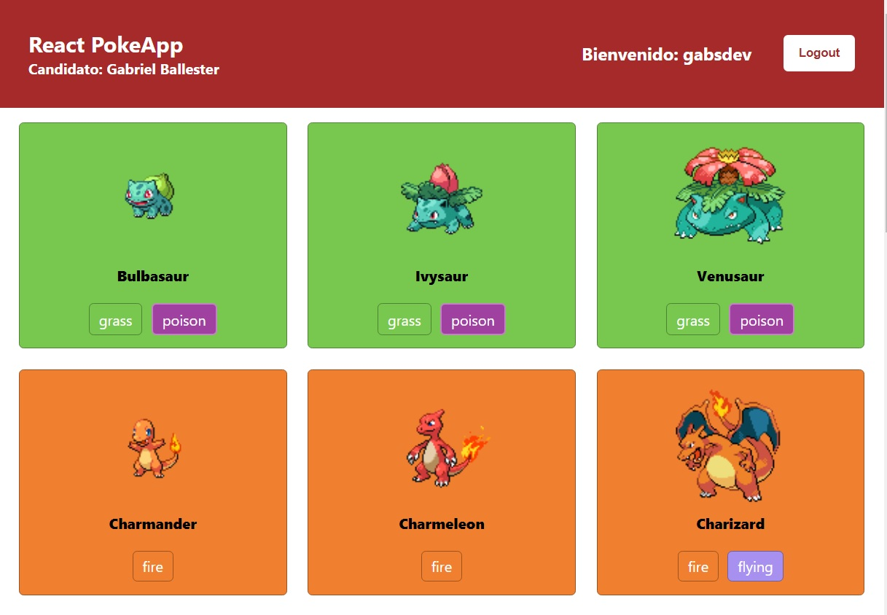

# React Pokédex

##### Desarrolador: Gabriel Ballester

##### Sobre el proyecto
- Web app con autenticación de usuario de forma que no deja acceder a home si no está logueado
- A su vez no deja acceder a login si ya está logueado.
- Muestra botón logout y usuario logueado almacenado en localStorage.
- Se alimenta de https://pokeapi.co/docs/v2
- Muestra los personajes con sus poderes por colores
- Muestra el fondo de la tarjeta con el color del poder principal de cada personaje.

##### Demo en Netlify:
https://gballester-react-pokeapp.netlify.app/

##### Instalar dependencias
`yarn install`

##### Arrancar proyecto
`yarn start`

El proyecto se abre en el navegador en la url: [http://localhost:3000](Screenshot_1.jpg)
##### Captura

